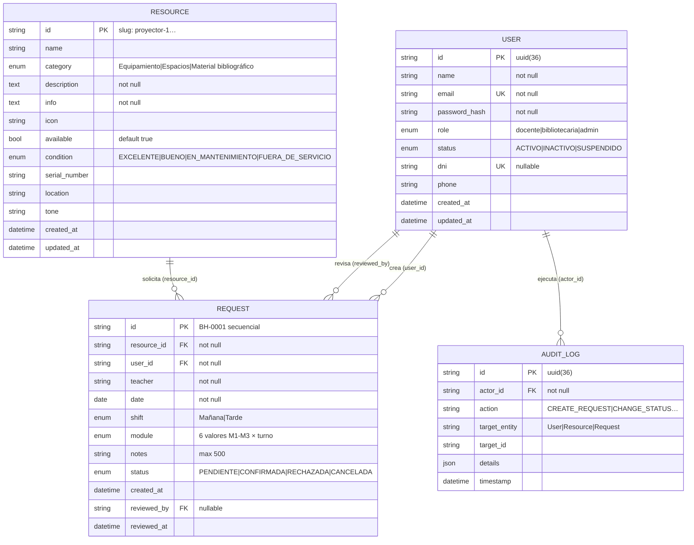

# Modelo de datos

**Control documental**

| Campo | Valor |
|---|---|
| **Código** | BH-18 |
| **Grupo** | Grupo D |
| **Equipo** | Madera Chiara · Riveros Silvio · Lasa Julio · Gonzalez Williams |
| **Fecha** | 2026-10-04 |
| **Versión** | 1.2 — sincronizado con los commits `ba345e7`/`3bd27b0` (índice único, Alembic, timestamps con zona horaria) |
| **Persistencia** | SQLite en desarrollo (`biblioteca_horizonte.db`), PostgreSQL opcional en producción |
| **Relacionados** | BH-10 (fuente local) · BH-17 · ADR-002 |

**Historial de cambios**

| Versión | Fecha | Cambio | Autor |
|---|---|---|---|
| 1.2 | 2026-10-04 | Índice único, Alembic y timestamps con zona horaria + control documental | Equipo |
| 1.0 | 2026-10-02 | Ingreso al repo (commit 99d53dc) | Equipo |

## 1. Diagrama entidad-relación

## 2. Entidades

### 2.1 `users` (`app/models/user.py`)

| Columna | Tipo | Restricción |
|---|---|---|
| `id` | String(36) | PK, `uuid4` |
| `name` | String(100) | NOT NULL |
| `email` | String(120) | NOT NULL, **UNIQUE**, index |
| `password_hash` | String(255) | NOT NULL (Werkzeug) |
| `role` | Enum | `docente` \| `bibliotecaria` \| `admin` |
| `status` | Enum | `ACTIVO` \| `INACTIVO` \| `SUSPENDIDO` (default `ACTIVO`) |
| `dni` | String(20) | UNIQUE, nullable |
| `phone` | String(20) | nullable |
| `created_at` / `updated_at` | DateTime | `datetime.now(ZoneInfo("America/Argentina/Cordoba"))` (B-08: ya sin `utcnow`) |

Relaciones: `requests` (1-N con `Request.user_id` y `Request.reviewed_by`), `audit_logs` (1-N con `AuditLog.actor_id`).

### 2.2 `resources` (`app/models/resource.py`)

| Columna | Tipo | Notas |
|---|---|---|
| `id` | String | PK **slug** (`"proyector-01"`), se expone en la URL |
| `name` | String(100) | NOT NULL |
| `category` | Enum | `Equipamiento` \| `Espacios` \| `Material bibliográfico` |
| `description` / `info` | Text | NOT NULL |
| `icon` | String | nombre del ícono (`Projector`, `Laptop`, …) |
| `available` | Boolean | default `true`; baja lógica (`false` = no reservable) |
| `condition` | Enum | `EXCELENTE` \| `BUENO` \| `EN_MANTENIMIENTO` \| `FUERA_DE_SERVICIO` |
| `serial_number` / `location` / `tone` | String | inventario y estilo |
| `created_at` / `updated_at` | DateTime | `datetime.now(ZoneInfo("America/Argentina/Cordoba"))` (B-08: ya sin `utcnow`) |

**Datos semilla (`seed.py`):** 2 proyectores + 4 notebooks, alineados con el caso de la cátedra.

### 2.3 `requests` (`app/models/request.py`)

| Columna | Notas |
|---|---|
| `id` | String(10) con formato **`BH-XXXX` secuencial**, generado en `create_request` |
| `resource_id`, `user_id` | FK a `resources` y `users` |
| `teacher` | nombre del docente, denormalizado (facilita la vista de Lucía) |
| `date` | `Date`; el schema rechaza fechas pasadas |
| `shift` | Enum: `Mañana · 08:00–12:00`, `Tarde · 13:00–17:00` |
| `module` | Enum de 6 valores: M1/M2/M3 × turno, con horario embebido en el texto |
| `notes` | String(500), nullable |
| `status` | Enum: `PENDIENTE` \| `CONFIRMADA` \| `RECHAZADA` \| `CANCELADA` (default `PENDIENTE`) |
| `created_at` | DateTime |
| `reviewed_by`, `reviewed_at` | quién y cuándo resolvió (FK a `users`) |

**Decisión registrada — catálogo de módulos:** los turnos y módulos se modelan como **enums fijos**, no como tabla: es un catálogo cerrado acordado con Lucía (2 turnos × 3 módulos), evita joins y migraciones por un dato casi estático. Si en el futuro los módulos varían por día u horario, se migrará a una entidad `ModuloHorario`.

### 2.4 `audit_logs` (`app/models/audit_log.py`)

Trazabilidad (RNF06): `actor_id`, `action`, `target_entity`, `target_id`, `details` (JSON), `timestamp`.

Acciones: `CREATE_USER`, `UPDATE_USER`, `DELETE_USER`, `CREATE_REQUEST`, `CHANGE_STATUS`, `CANCEL_REQUEST` (+ equivalentes de recursos).

Los cambios de estado registran **`details.old_status` y `details.new_status`** — cumple con registrar el estado anterior.

## 3. Restricciones

| Restricción | ¿Existe? | Implementación |
|---|---|---|
| `users.email` único | Sí | `unique=True` + índice |
| `users.dni` único | Sí | `unique=True` |
| Email duplicado al crear usuario → 409 | Sí | `user_service.create_user` |
| Estado inicial `PENDIENTE` | Sí | default en la columna |
| Fecha no pasada | Sí | `CreateRequestSchema.validate_date_not_past` (422) |
| Turno ↔ módulo coherentes | Sí | `CreateRequestSchema.validate_shift_module_consistency` (422) |
| Duplicado al crear → 409 | Sí | `request_service.create_request` |
| Duplicado al confirmar → rechazo | Sí | `request_service.review_request` re-verifica el conflicto |
| **1 `CONFIRMADA` por recurso+fecha+turno+módulo (índice único en BD)** | Sí | **`uq_confirmed_request_slot`** (parcial, `WHERE status='CONFIRMADA'`) + `IntegrityError` → 409 |
| `BH-XXXX` sin colisiones ante concurrencia | No | `SELECT MAX` sin transacción (B-10) |
| Migraciones de esquema (`migrations/`) | Sí | Alembic inicializado — `2ccd2ab74c38_initial` |

### Estrategia de defensa en profundidad para la regla central (ADR-002) — Completa

1. **Capa de servicio ():** `create_request` y `review_request` filtran `status="CONFIRMADA"` por `resource_id + date + shift + module` y rechazan con **409**.
2. **Capa de datos (— B-02 cerrada):** índice único parcial `uq_confirmed_request_slot` sobre `(resource_id, date, shift, module)` para `status='CONFIRMADA'` (migración Alembic `2ccd2ab74c38_initial`); el `IntegrityError` del commit se revuelve en **409**, de modo que ni un error de código ni una consulta directa a la BD permitan el duplicado.

## 4. Datos semilla esperados (según el caso)

| Recurso | Cantidad | `condition` |
|---|---|---|
| Proyectores | 2 | `EXCELENTE` / `BUENO` |
| Notebooks | 4 | `EXCELENTE` / `BUENO` |

Usuarios: 1 `bibliotecaria` (Lucía) + 1 `admin` + 2 `docente` de prueba, creados con `reset_passwords.py` / seed.

## Referencias normativas

- ISO/IEC 25010:2011 – Modelos de calidad de sistemas y software.
- Chen, P. (1976) – *The Entity-Relation Model* (modelado de datos).
